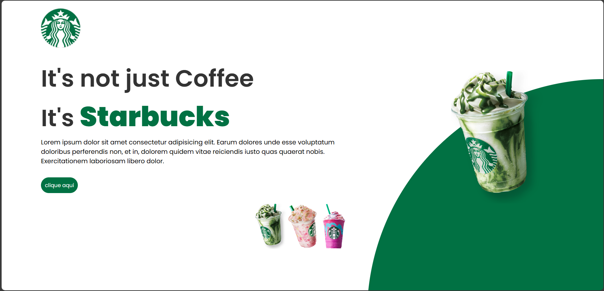
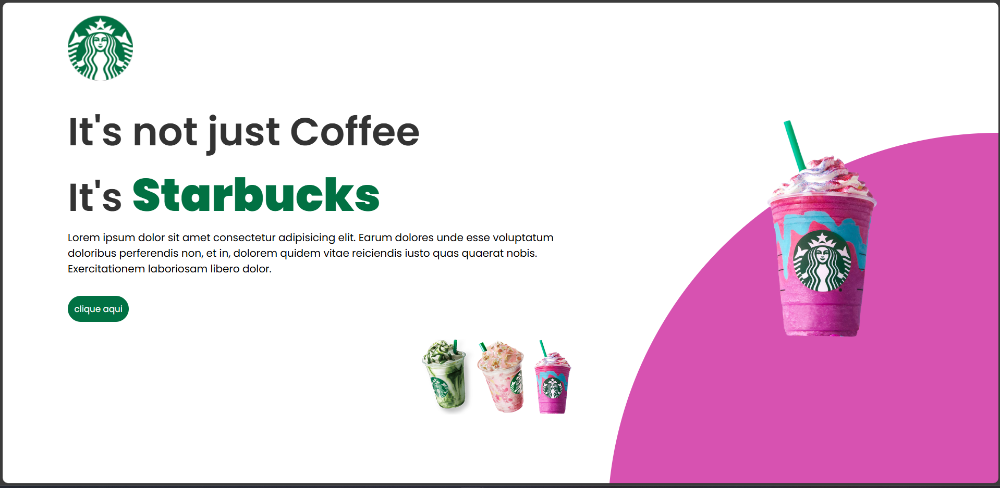

☕ Projeto Starbucks - Landing Page

Este é um projeto de **Landing Page** inspirado na marca Starbucks. Foi desenvolvido com HTML, CSS e JavaScript com foco em layout moderno, responsivo e interativo.

🛠️ Tecnologias usadas

- HTML5
- CSS3
- JavaScript
- Google Fonts (Poppins)

💻 Funcionalidades

- Troca de imagem e cor ao clicar nos botões
- Animações com `hover`
- Layout moderno com design circular (clip-path)

<h3> Imagens do projeto</h3>

